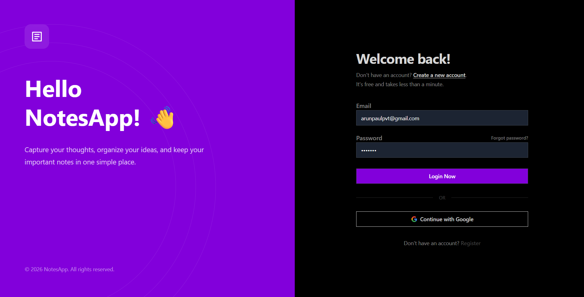
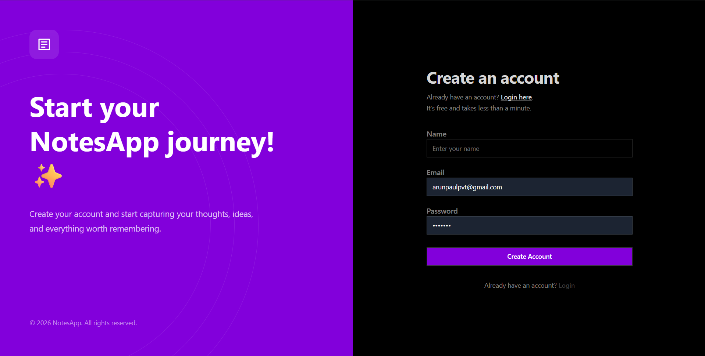
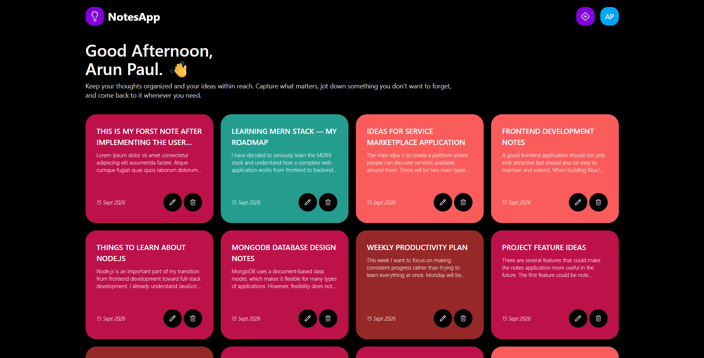
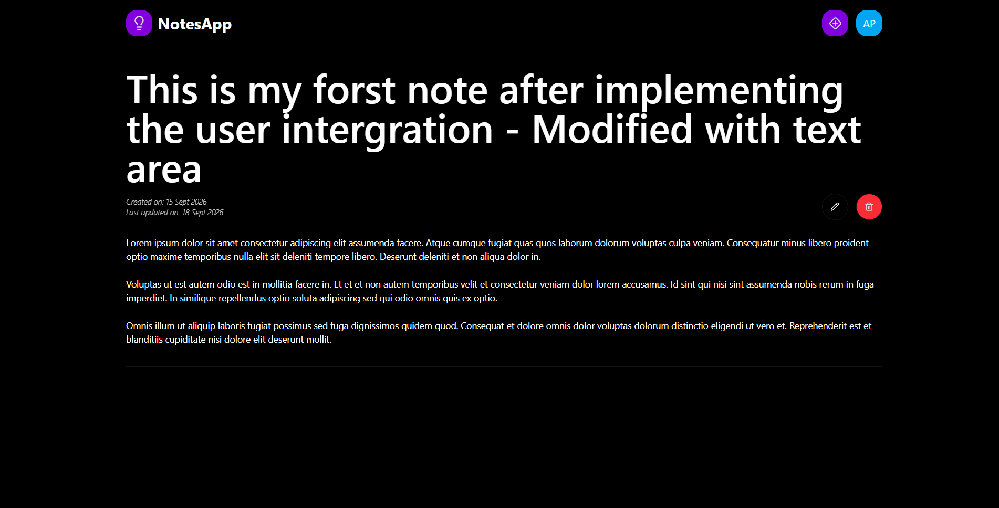
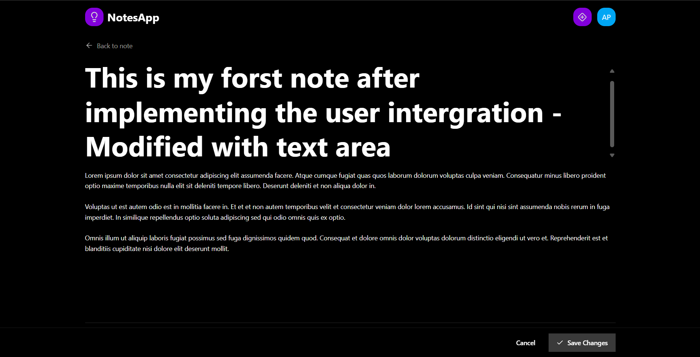
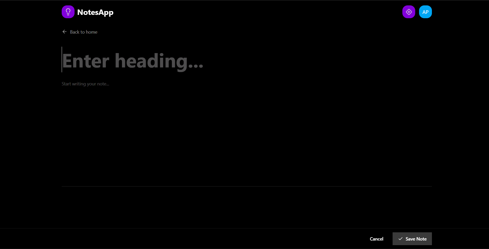

<div align="center">

  # 💡 NotesApp — Modern Full-Stack Note Management

  An intuitive, responsive MERN-stack web application built to simplify personal knowledge capture, task organization, and daily ideation.

  [](https://note-app-mk51.onrender.com/)
  [](https://github.com/YOUR_USERNAME/YOUR_REPO_NAME)

  <br />

  
  
  
  
  
  
  

</div>

---

## 📌 Project Overview

**NotesApp** was engineered to explore full-stack development patterns, state synchronization, and scalable data operations. The goal was to build a clean UI paired with a secure RESTful API layer for end-to-end CRUD operations.

### Key Learning Objectives Addressed:
* **Full-Stack CRUD Architecture:** Seamless payload delivery from React frontend to Node/Express backend and MongoDB.
* **State & Routing Control:** Global UI and data synchronization using **Redux Toolkit** and **React Router**.
* **Database Modeling:** Efficient document modeling in MongoDB with dynamic client-side grid mapping.
* **Modern Interface Engineering:** Dark-mode visual architecture leveraging **Tailwind CSS** and **DaisyUI**.

---

## ✨ Features Highlights

| Feature | Description |
| :--- | :--- |
| **User Authentication** | Personalized login and user registration interface with OAuth integration ready. |
| **Dynamic Note Dashboard** | Personalized greeting header with dynamic colored card views for notes. |
| **Focused Detail View** | Dedicated screen for deep-reading content with dynamic timestamp tracking. |
| **Distraction-Free Editor** | Clean view for adding new notes and real-time content updating. |
| **Responsive Dark UI** | Vibrant high-contrast dark theme powered by DaisyUI components. |

---

## 🖼️ Application Showcase

<details open>
<summary>📸 <b>Click to view UI Walkthrough</b></summary>

<br/>

### 1. Welcome & Authentication
Secure login and sign-up interfaces built with input validation and clean dynamic styling.
<table>
  <tr>
    <td width="50%"><b>Login View</b></td>
    <td width="50%"><b>Registration View</b></td>
  </tr>
  <tr>
    <td></td>
    <td></td>
  </tr>
</table>

---

### 2. Dashboard
Personalized user workspace listing notes in a dynamic grid with quick actions.


---

### 3. Dedicated Note View & Editing
Read notes uninterrupted or edit titles and markdown details on the fly.
<table>
  <tr>
    <td width="50%"><b>Note Detail View</b></td>
    <td width="50%"><b>Edit Note View</b></td>
  </tr>
  <tr>
    <td></td>
    <td></td>
  </tr>
</table>

---

### 4. Note Creation
Clean canvas screen with simple bottom control actions to post ideas directly to MongoDB.


</details>

---

## 🛠️ Tech Stack & Dependencies

```text
Frontend:    React.js, Redux Toolkit, React Router, JavaScript, Tailwind CSS, DaisyUI
Backend:     Node.js, Express.js
Database:    MongoDB (Mongoose ODM)
Deployment:  Render.com
```

---

## 🚀 Getting Started Locally

### 1. Clone the repository
```bash
git clone https://github.com/YOUR_USERNAME/YOUR_REPO_NAME.git
cd YOUR_REPO_NAME
```

### 2. Environment Setup
Create a `.env` file in the root server directory:
```env
PORT=5000
MONGO_URI=your_mongodb_connection_string
JWT_SECRET=your_jwt_secret
```

### 3. Install Dependencies & Run
```bash
# Install Server Dependencies
npm install

# Install Client Dependencies
cd client && npm install

# Run Backend & Frontend concurrently
npm run dev
```

---

## 💡 Future Enhancements & Roadmap

- [ ] **Rich Text / Markdown Editor:** Integrate WYSIWYG or Markdown formatting (e.g., SimpleMDE or TipTap) inside note creation.
- [ ] **Pin & Favorite Notes:** Allow users to pin high-priority notes to the top of the dashboard grid.
- [ ] **Search & Tagging System:** Implement dynamic search filters and colorful tags for easy category indexing.
- [ ] **Auto-Save Functionality:** Debounced auto-save triggers in the editing view to prevent progress loss.
- [ ] **Trash & Recovery Bin:** Soft-delete functionality allowing users to recover accidentally deleted notes.
